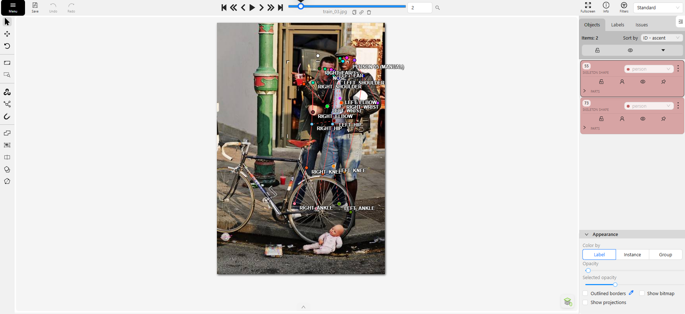
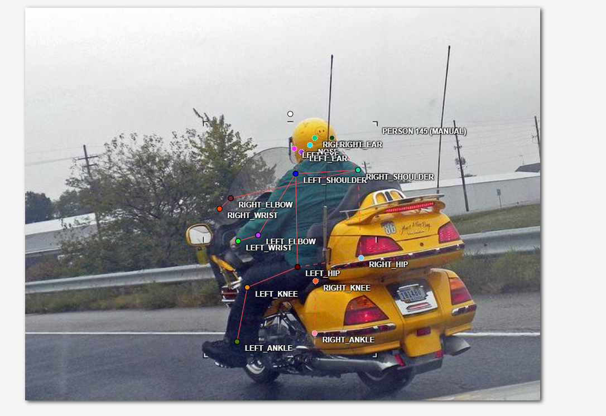
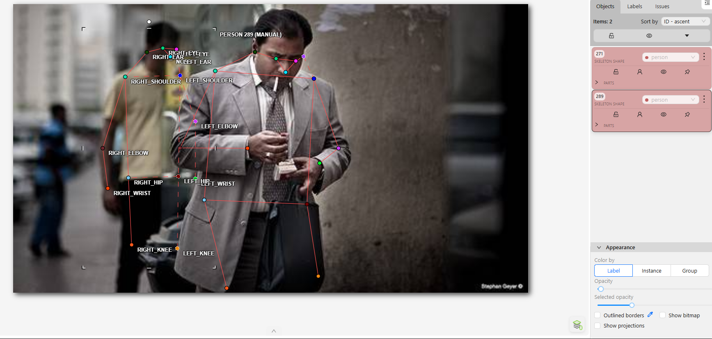

# Mini guideline - nhóm: Không có  |  người gán: NGUYỄN ĐỨC TÙNG  |  ngày: 16/09/2026

## 1. Luật bắt buộc (đã thống nhất cả lớp - không sửa)

- Bộ 17 điểm COCO, đúng tên, đúng thứ tự. Lấy từ file `.SVG` chung.
- Mọi người trong ảnh đều có **đủ 17 điểm**. Điểm không dùng được thì gắn cờ, không xoá.
- Trái/phải tính theo **cơ thể người**, không theo bức ảnh.
- Bị che, còn trong khung -> `v = 1`, **vẫn đặt chấm** ở vị trí ước lượng.
- Ra ngoài mép ảnh -> `v = 0`, **không** đặt chấm.
- Không dùng `Hidden` (`h`) - nó không được lưu vào file.

## 2. Luật của nhóm bạn (phải điền)

| Tình huống | Luật nhóm bạn chọn | Vì sao |
| --- | --- | --- |
| Hông của người mặc quần áo dài | Đặt điểm sâu vào trong lớp áo một chút, ước lượng đúng tâm khớp hông thật sự bên dưới lớp vải, không đặt lên bề mặt vải. | Vị trí khớp thật (xương chậu) mới là thứ model cần học, bề mặt vải có thể lệch xa vị trí khớp thật tùy kiểu dáng trang phục. |
| Tai bị tóc hoặc mũ bảo hiểm che một phần | Dùng Occluded (v=1), vẫn đặt chấm ước lượng vị trí tai. | Tóc/mũ chỉ che bề mặt, vị trí khớp vẫn suy luận được từ hình dạng đầu, không phải trường hợp ra ngoài khung. |
| Người bị cắt ở mép ảnh (chỉ thấy từ hông trở lên) | Các khớp từ đầu gối, mắt cá trở xuống đánh Outside (v=0), không đặt chấm. | Phần cơ thể đó thực sự không có mặt trong khung ảnh, khác với bị che (occluded) vốn vẫn nằm trong khung nhưng bị vật cản. |
| Cổ tay nằm sau tay lái / sau thân mình | Dùng Occluded (v=1), vẫn đặt chấm ước lượng. | Cổ tay vẫn nằm trong khung ảnh, chỉ bị vật thể khác (tay lái, thân người) che khuất bề mặt, vị trí vẫn suy luận được. |
| Hai người chồng lên nhau | Người không bị che thì gán bình thường (Visible); người bị người kia che thì đánh Occluded cho các khớp bị che, dựa vào cấu trúc/tư thế cơ thể để suy luận vị trí khớp thuộc về đúng người nào. | Tránh gán nhầm khớp của người này sang người khác khi hai cơ thể chồng lấn, đồng thời vẫn giữ đúng luật Occluded cho phần bị che. |
| Người nhỏ đến mức nào thì không gán nữa | Khi người ở quá xa, hình ảnh quá mờ đến mức không thể xác định rõ vị trí các khớp, sẽ không gán skeleton cho người đó. | Gán khớp khi không thấy rõ dẫn đến đoán mò, tạo nhãn sai lệch còn tệ hơn là bỏ qua người đó. |

## 3. Ba ca mơ hồ đã gặp (bắt buộc, ghi ít nhất 3)

### Ca 1 - ảnh `train_03.jpg`, người thứ `2`, khớp `toàn bộ khớp bên trái (vai, khuỷu tay, cổ tay, hông, đầu gối, mắt cá), trừ các điểm trên khuôn mặt`

- Mơ hồ ở chỗ nào: Ảnh có 2 người, người thứ 2 (thấp và bé hơn) đang được người thứ 1 khoác tay, khiến toàn bộ nửa thân bên trái của người thứ 2 bị che khuất bởi cánh tay và thân người thứ 1. Chỉ các điểm trên khuôn mặt (nose, eyes, ears) là còn nhìn rõ.
- Bạn quyết thế nào: Đánh Occluded (v=1) cho toàn bộ khớp bên trái bị che, vẫn đặt chấm ước lượng dựa theo tư thế và tỷ lệ cơ thể suy ra từ phần còn nhìn thấy.
- Vì sao: Các khớp đó vẫn nằm trong khung ảnh, chỉ bị vật cản (thân người khác) che, không phải trường hợp ra ngoài khung nên không thể đánh Outside.
- Nếu người khác quyết ngược lại thì model học sai cái gì: Nếu người khác bỏ qua không gán (coi như Outside) thì model sẽ học nhầm rằng khớp bị che hoàn toàn không tồn tại/không cần dự đoán, thay vì học cách suy luận vị trí khớp từ ngữ cảnh khi bị che - đây là kỹ năng quan trọng của model pose estimation.

### Ca 2 - ảnh `train_06.jpg`, người thứ `1`, khớp `tai/mặt bên phải (bị mũ bảo hiểm che) và các khớp bên phải cơ thể (vai, khuỷu tay, cổ tay, hông phải)`

- Mơ hồ ở chỗ nào: Ảnh chỉ có 1 người lái xe máy, đội mũ bảo hiểm full-face che gần hết phần tai và mặt bên phải. Đồng thời người này mặc trang phục rộng, khổ người to, ảnh lại chụp chếch từ trái qua nên các khớp bên phải cơ thể (vai, khuỷu tay, cổ tay, hông) cũng khó xác định chính xác.
- Bạn quyết thế nào: Đánh Occluded (v=1) cho tai/mặt bên phải bị mũ che, và Occluded (v=1) cho các khớp bên phải cơ thể khó thấy, ước lượng vị trí dựa vào khớp bên trái đối xứng, hình dạng mũ bảo hiểm và dáng ngồi tổng thể trên xe.
- Vì sao: Tất cả các khớp trên vẫn nằm trong khung hình, chỉ bị mũ bảo hiểm, góc chụp và trang phục rộng che khuất bề mặt chứ không phải ra ngoài khung ảnh.
- Nếu người khác quyết ngược lại thì model học sai cái gì: Nếu người khác đặt các khớp đó là Visible (v=2) dù không thấy rõ, tọa độ ước lượng có thể sai lệch nhiều mà model lại học với độ tin cậy cao (v=2), làm nhiễu dữ liệu train ở đúng những vị trí khó nhất.

### Ca 3 - ảnh `train_13.jpg`, người thứ `(người ở xa trong nền, không được gán)`, khớp `toàn bộ 17 điểm - quyết định có gán hay không gán cả người đó`

- Mơ hồ ở chỗ nào: Có một người xuất hiện trong ảnh nhưng ở rất xa và hình ảnh quá mờ, khó xác định rõ ràng vị trí bất kỳ khớp nào trên cơ thể người đó.
- Bạn quyết thế nào: Không gán skeleton cho người này.
- Vì sao: Vì không thể thấy rõ để xác định đúng vị trí các khớp, gán đại sẽ tạo ra nhãn sai/đoán mò thay vì dữ liệu đáng tin cậy.
- Nếu người khác quyết ngược lại thì model học sai cái gì: Nếu người khác vẫn cố gán skeleton cho người mờ/xa đó, model sẽ học từ tọa độ không chính xác (đoán mò), làm giảm chất lượng học ở các trường hợp người nhỏ/xa - có thể khiến model học sai tỷ lệ hoặc vị trí khớp chuẩn.

